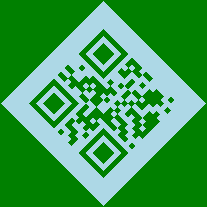

# 📱 QR-CODE-GENERATE 📱

A collection of Python scripts that demonstrate various ways to generate and customize QR codes using the `qrcode` and `segno` libraries. Output images are saved in the project root or the `images/` folder.


## Table of Contents

- [✨ Features](#-features)  
- [📋 Prerequisites](#-prerequisites)  
- [🔧 Installation](#-installation)  
- [🚀 Usage](#-usage)  
- [📝 Scripts](#-scripts)  
- [🖼️ Images](#️-images)  
- [🔄 CI/CD](#-cicd)  
- [📄 License](#-license)  

## ✨ Features

- 🔲 Generate simple QR codes from text/URLs  
- 🎨 Customize colors (`fill_color`, `back_color`, `light`, `dark`)  
- 🔄 Rotate QR codes and save as images  
- 🎬 Create animated/artistic QR codes  
- 💾 Save outputs as PNG/GIF  

## 📋 Prerequisites

- Python 3.6+  
- `qrcode[pil]`  
- `segno`  
- `Pillow`  

## 🔧 Installation

```sh
pip install qrcode[pil] segno pillow
```

## 🚀 Usage

Run any of the scripts from the project root:

```sh
python QR-CODE-GENERATE/qrcodegeneration.py
python QR-CODE-GENERATE/qrcode2.py
python QR-CODE-GENERATE/qrcode3.py
python QR-CODE-GENERATE/qrcode4.py
python QR-CODE-GENERATE/qrcode6.py
python QR-CODE-GENERATE/qrcode7.py
python QR-CODE-GENERATE/qrcodee5.py
```

Each script will generate an image (PNG/GIF) in the current directory or you can move them into `images/` for organization.

## 📝 Scripts

- [qrcodegeneration.py](qrcodegeneration.py) – basic QR code using `qrcode` + `Pillow`  
- [qrcode2.py](qrcode2.py) – light-blue QR code with border using `segno`  
- [qrcode3.py](qrcode3.py) – dark-blue QR code with custom quiet zone  
- [qrcode4.py](qrcode4.py) – green data modules on blue code  
- [qrcode6.py](qrcode6.py) – rotated QR code saved as PNG  
- [qrcode7.py](qrcode7.py) – animated QR code (GIF) with background image  
- [qrcodee5.py](qrcodee5.py) – colored modules and background using `segno`  

## 🖼️ Images

All generated images are available in the [images/](images/) directory:

```text
animated_qrcode.gif
darkblue_qrcode.png
formatted_rotated_qrcode.png
green_datadark_qrcode.png
green_datamodules_qrcode.png
lightblue_qrcode.png
...
```

### 📷 Sample Images Gallery

<table>
  <tr>
    <td></td>
    <td></td>
    <td></td>
  </tr>
  <tr>
    <td></td>
    <td></td>
    <td></td>
  </tr>
</table>

## 🔄 CI/CD

GitHub Actions workflow for deploying static content is defined in  
[.github/workflows/static.yml](.github/workflows/static.yml).

## 📄 License

This project is released under the MIT License.  
See [LICENSE](LICENSE) for details.
